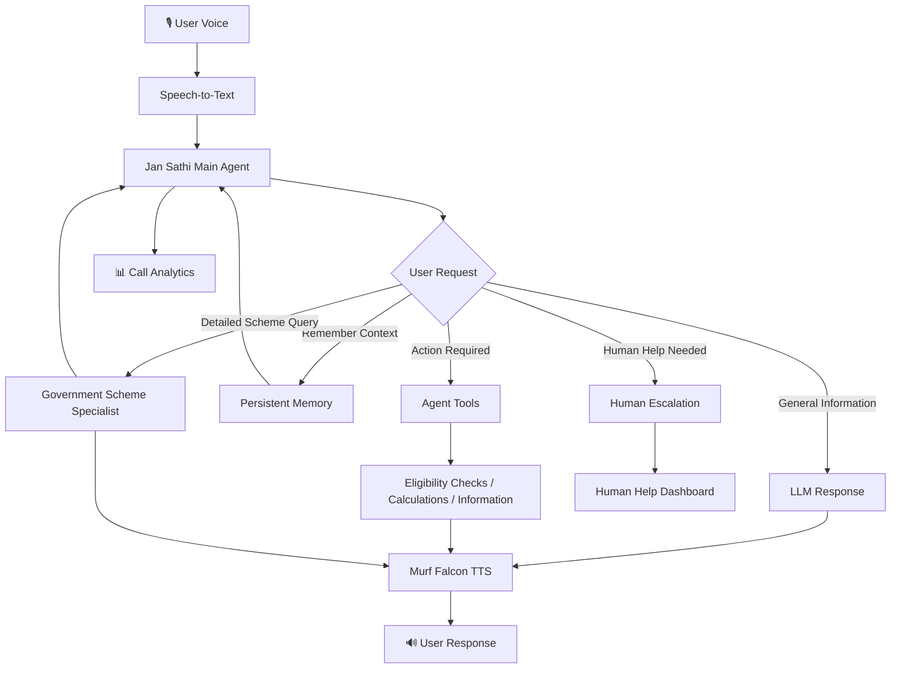

# 🇮🇳 Jan Sathi (जन साथी)

### Your Voice. Your Guide. Your Saathi.

Jan Sathi is a real-time AI voice assistant designed to help users navigate **Indian government schemes, financial services, digital payments, basic financial calculations, and cyber-safety information** through natural voice conversations.

Built as part of **10 Days of Voice Agents — VoiceForBharat Edition**, Jan Sathi evolved from a basic voice assistant into a more complete agentic system with persistent memory, function tools, government scheme eligibility checks, outbound calling, human escalation, call analytics, and multi-agent handoffs.

> 🎙️ Built with **Murf Falcon + LiveKit**

---

## ✨ Key Features

- 🎤 **Real-Time Voice Conversations** — Natural voice interaction powered by LiveKit and Murf Falcon
- 🧠 **Persistent Memory** — Remembers relevant information across conversations with controlled memory handling
- 🏛️ **Government Scheme Assistance** — Helps users understand selected government financial schemes
- ✅ **Eligibility Checks** — Conversational eligibility evaluation based on available scheme criteria
- 🧮 **Financial Calculations** — Supports calculations such as loan EMI
- 📞 **Outbound Calling** — Supports agent-initiated voice interactions
- 🧑‍💻 **Human Escalation** — Allows users to request human assistance when the AI cannot adequately help
- 📊 **Call Analytics** — Tracks call outcomes, success rate, and recent call activity
- 🔀 **Multi-Agent Handoff** — Transfers detailed government scheme questions to a specialist agent
- 🛡️ **Cyber-Safety Guidance** — Provides basic guidance for situations such as suspected UPI fraud
- 🇮🇳 **Indian Language Support** — Designed for Hindi, English, and code-mixed conversations

---

# 🎯 The Problem

Accessing information about government schemes and financial services can sometimes require navigating multiple websites, understanding eligibility requirements, and interpreting complex information.

Users may have questions such as:

- Which government scheme might I be eligible for?
- What documents do I need?
- What are the benefits of PMJJBY or PMSBY?
- How does UPI work?
- How can I calculate my loan EMI?
- What should I do if I suspect digital payment fraud?
- Who can help when an AI assistant cannot solve my problem?

Jan Sathi explores whether a **voice-first interface** can make accessing this information simpler.

Instead of searching through multiple sources or filling in complicated forms, a user can simply ask:

> "Which government schemes might I be eligible for?"

or:

> "I am 25 years old and have a bank account. Can you tell me if I am eligible for PMJJBY?"

The agent can understand the request, gather relevant information, use appropriate tools, and guide the conversation.

---

# 🤖 How Jan Sathi Works

At a high level, the system works like this:

```text
User speaks
    ↓
Speech-to-Text
    ↓
Jan Sathi AI Agent
    ↓
┌───────────────────────────────────────┐
│ LLM Reasoning                         │
│ Tools                                 │
│ Persistent Memory                     │
│ Government Scheme Eligibility Checks  │
│ Human Escalation                      │
│ Specialist Agent Handoff              │
└───────────────────────────────────────┘
    ↓
Text Response
    ↓
Murf Falcon Text-to-Speech
    ↓
User hears the response
````

LiveKit provides the real-time infrastructure that connects these components and enables a conversational voice experience.

---

# 🚀 Core Features

## 🧠 Persistent Memory

A useful assistant should not always behave as if it is meeting the user for the first time.

Jan Sathi includes persistent memory using SQLite so that relevant information can be retained across conversations.

Memory handling is designed around user control and intentional data storage. The agent does not simply treat every piece of conversation as information that should automatically be remembered.

This allows conversations to feel more continuous while keeping privacy and user control in mind.

---

## 🏛️ Government Scheme Assistance

Jan Sathi can provide information about selected Indian government financial schemes and perform eligibility-related checks based on available criteria.

Supported scheme-related assistance includes information about:

* **PMJJBY** — Pradhan Mantri Jeevan Jyoti Bima Yojana
* **PMSBY** — Pradhan Mantri Suraksha Bima Yojana
* **PMJDY** — Pradhan Mantri Jan Dhan Yojana
* **Atal Pension Yojana**
* **Sukanya Samriddhi Yojana**
* **PM-KISAN**

The eligibility functionality is designed to provide informational guidance based on available scheme criteria and does not represent final official approval.

---

## 🛠️ Tools and Actions

One of the main goals of Jan Sathi was to move beyond a simple conversational chatbot.

The agent can use tools when appropriate for tasks such as:

* Scheme eligibility checks
* Scheme and document information
* Financial calculations
* Memory operations
* Human escalation

This allows the agent to take useful actions instead of simply generating text responses.

---

## 📞 Outbound Calling

Jan Sathi also supports outbound voice interactions.

When the agent initiates a conversation, the flow is designed to clearly communicate:

* Who is calling
* Why the call is being made
* How the user can opt out

This feature explores the additional design and consent considerations involved when an AI agent initiates a voice interaction.

---

## 🧑‍💻 Human Escalation

An AI assistant should also know when human help may be needed.

Jan Sathi includes a human escalation workflow that:

1. Recognizes when human assistance may be useful
2. Explains what information may be shared
3. Requests user permission
4. Creates an escalation request after consent
5. Generates a reference ID
6. Provides the user with a clear next step

A dedicated dashboard allows human help requests to be viewed and managed.

---

## 📊 Call Analytics

Building an AI agent is only part of the challenge. It is also useful to understand whether conversations are reaching meaningful outcomes.

Jan Sathi includes a Call Analytics Dashboard that tracks:

* Total calls
* Successful calls
* Failed calls
* Success rate
* Recent call history

A conversation can be marked successful when defined outcomes are achieved, such as completing an eligibility check.

---

# 🔀 Multi-Agent Handoff

As Jan Sathi grew, one important design question emerged:

> **Should one agent try to become an expert at everything?**

To explore this, Jan Sathi includes a separate **Government Scheme Specialist**.

```text
                User
                  │
                  ▼
             Jan Sathi
              Main Agent
                  │
        Detailed Government
           Scheme Question?
                  │
                  ▼
     Government Scheme Specialist
                  │
                  ▼
         Continues Conversation
```

The main Jan Sathi agent handles general conversations involving financial services, digital payments, calculations, cyber-safety guidance, memory, and escalation.

When the user requires deeper assistance with government schemes, the main agent announces the handoff and transfers the conversation to the Government Scheme Specialist.

The specialist receives the conversation context and continues the interaction without requiring the user to repeat their entire question.

---

# 🐛 A Key Challenge: The Specialist Went Silent

One of the most interesting problems during development happened during the multi-agent handoff.

The main agent successfully announced:

> "I will connect you to our Government Scheme Specialist."

The handoff technically happened.

But then the specialist went silent.

The issue was that switching to the new agent did not automatically trigger a new response generation turn. The specialist had successfully taken over the session, but it was waiting for the user to speak again.

The solution involved explicitly triggering response generation when the specialist entered the conversation and preserving the existing conversation history during the handoff.

This became an important lesson:

> **A system can be technically working while the user experience is still broken.**

The agent handoff worked internally, but from the user's perspective, silence meant the feature was not actually complete.

Testing the real conversation flow was just as important as running automated tests.

---

# 🏗️ Architecture



---

# 🛠️ Tech Stack

| Technology         | Purpose                                            |
| ------------------ | -------------------------------------------------- |
| **LiveKit Agents** | Real-time voice infrastructure and agent framework |
| **Murf Falcon**    | Text-to-Speech                                     |
| **Deepgram**       | Speech-to-Text                                     |
| **Google Gemini**  | Agent reasoning                                    |
| **Python**         | Backend voice agent                                |
| **Next.js**        | Frontend                                           |
| **TypeScript**     | Frontend development                               |
| **SQLite**         | Persistent memory and local data storage           |

---

# 📁 Project Structure

```text
murf-livekit-starter/
│
├── backend/
│   ├── src/
│   │   ├── agent.py
│   │   ├── prompt.py
│   │   ├── memory.py
│   │   ├── schemes_data.py
│   │   └── ...
│   │
│   └── tests/
│       ├── test_agent.py
│       ├── test_day5_eligibility.py
│       ├── test_day7_escalation.py
│       ├── test_day8_analytics.py
│       └── test_day9_handoff.py
│
├── frontend/
│   ├── app/
│   ├── components/
│   └── ...
│
└── README.md
```

---

# 🚀 Getting Started

## 1. Clone the Repository

```bash
git clone https://github.com/UnWebVoid/murf-livekit-starter.git
cd murf-livekit-starter
```

---

## 2. Configure Environment Variables

Create your local environment configuration files based on the example files included in the project.

Add the required API keys and configuration values locally.

**Do not commit API keys, secrets, phone numbers, or private user data to the repository.**

The project uses services such as:

* Murf API
* LiveKit
* Google Gemini
* Deepgram

Configure the required credentials in your local environment files.

---

## 3. Set Up the Backend

Navigate to the backend directory and install the required dependencies.

```bash
cd backend
```

Create and activate a Python virtual environment, then install the dependencies.

Example:

```bash
python -m venv .venv
```

On Windows:

```bash
.venv\Scripts\activate
```

Install dependencies:

```bash
pip install -e .
```

---

## 4. Start LiveKit

Run the LiveKit development server.

```bash
livekit-server --dev
```

---

## 5. Start the Voice Agent

From the backend directory:

```bash
python src/agent.py dev
```

The LiveKit agent worker should start and register the Jan Sathi voice agent.

---

## 6. Start the Frontend

Open another terminal and navigate to the frontend directory:

```bash
cd frontend
```

Install dependencies:

```bash
pnpm install
```

Start the development server:

```bash
pnpm dev
```

Then open:

```text
http://localhost:3000
```

Connect to the voice agent and start a conversation.

---

# 🧪 Testing

The project includes automated tests covering different parts of the agent functionality.

From the backend directory:

```bash
pytest -v
```

The project also uses Ruff for code quality checks:

```bash
ruff check src tests
```

---

# 💬 Example Conversations

### General Financial Question

> **User:** What is UPI?

Jan Sathi should answer directly without transferring the conversation.

---

### Government Scheme Question

> **User:** I want detailed information about PMJJBY, including eligibility and required documents.

Expected flow:

1. Jan Sathi identifies that detailed specialist help is useful.
2. The main agent announces the handoff.
3. The conversation is transferred to the Government Scheme Specialist.
4. The specialist introduces itself.
5. The specialist continues answering the existing question without requiring the user to repeat it.

---

### Financial Calculation

> **User:** Calculate the EMI for a ₹5 lakh loan at 8.5% interest for 5 years.

The agent can use the appropriate calculation functionality to help answer the request.

---

### Human Help

> **User:** I need help from a human.

Jan Sathi can begin the escalation process, explain what information may be shared, request permission, and create an escalation request.

---

# 🧪 Development Journey

Jan Sathi was built and expanded during **10 Days of Voice Agents — VoiceForBharat Edition**.

The project evolved through multiple stages, including:

* **Core Voice Agent** — Building the real-time conversational foundation
* **Memory** — Adding persistent user context with controlled memory handling
* **Government Scheme Eligibility** — Creating tools for informational eligibility checks
* **Outbound Calling** — Supporting agent-initiated voice interactions
* **Human Escalation** — Allowing users to request help beyond the AI agent
* **Call Analytics** — Tracking call outcomes and conversation success
* **Multi-Agent Handoff** — Introducing a Government Scheme Specialist for detailed scheme queries
* **Testing and Debugging** — Improving the project through automated tests and real conversation testing

The project was built by extending the **Murf LiveKit Starter** into a customized voice agent focused on financial services and government scheme assistance.

---

# 🚀 What's Next?

Jan Sathi is an experimental project and can be further improved with:

* More government schemes and verified data sources
* Improved multilingual and code-mixed conversations
* Additional specialist agents
* More advanced human escalation workflows
* Real-time analytics updates
* Production deployment
* Improved monitoring and reliability

The goal is to make the system more capable without making the experience more complicated for the user.

---

# 🔗 Links

* 💻 **GitHub Repository:** [click here](https://github.com/UnWebVoid/murf-livekit-starter)
* 📝 **DEV Article:** [click here](https://dev.to/unwebvoid/building-jan-sathi-my-10-day-voice-agent-journey-with-murf-falcon-and-livekit-4f9g)
* 💼 **LinkedIn:** [click here](https://lnkd.in/p/dYVwWCnP)

---

# 🙌 Acknowledgements

This project was built as part of **10 Days of Voice Agents — VoiceForBharat Edition**.

The project uses and extends the **Murf LiveKit Starter** as its foundation.

Special thanks to:

* **Murf AI** for Murf Falcon Text-to-Speech
* **LiveKit** for real-time voice infrastructure
* **Google Gemini**
* **Deepgram**
* The **10 Days of Voice Agents — VoiceForBharat Edition** community

---

## 🇮🇳 Jan Sathi (जन साथी)

### Your Voice. Your Guide. Your Saathi.

🎙️ Built with **Murf Falcon + LiveKit**

````
